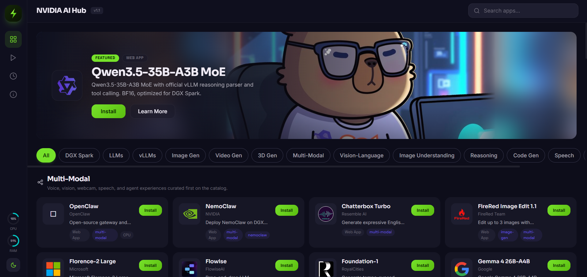

# NVIDIA AI Hub by Pho Tue SoftWare Solutions JSC

[](./CONTRIBUTING.md)
[](./SECURITY.md)
[](./LICENSE)
[](./COMMERCIAL-LICENSE.md)
[](./docs/github-actions.md)
[](https://github.com/hitechcloud-vietnam/spark-ai-hub/stargazers)
[](https://github.com/hitechcloud-vietnam/spark-ai-hub/issues)
[](./LICENSE)
[](https://github.com/hitechcloud-vietnam/spark-ai-hub/commits/main)
[](https://github.com/hitechcloud-vietnam/spark-ai-hub/graphs/contributors)
[](https://github.com/hitechcloud-vietnam/spark-ai-hub)
[](https://github.com/hitechcloud-vietnam/spark-ai-hub/pulls?q=is%3Apr+is%3Aclosed)
[](https://github.com/hitechcloud-vietnam/spark-ai-hub/tags)
[](https://github.com/hitechcloud-vietnam/spark-ai-hub/pulse)

**Quick links:** [Overview](#overview) · [Installation](./docs/installation.md) · [Production deployment](./docs/deployment-production.md) · [Local development](./docs/local-development.md) · [Contributing](#contributing) · [Security](#security-and-conduct) · [Community](#community) · [Licensing](#license)

**Your AI app store for NVIDIA GPU platforms.** Browse, install, and launch AI apps with one click.



## Overview

NVIDIA AI Hub by Pho Tue SoftWare Solutions JSC provides a web UI and API for managing curated AI application recipes across NVIDIA GPU workstations, servers, and DGX-class systems.

The project includes:

- A `FastAPI` backend for recipe, system, and container management
- A `React + Vite` frontend served as static files by the backend
- A Docker-based runtime model for AI applications in `registry/recipes`

## Local development

For a complete local dev workflow (backend + frontend), production build validation, and white-page troubleshooting, see [`docs/local-development.md`](./docs/local-development.md).

## Installation and deployment

For Linux deployment, Windows and macOS setup boundaries, Docker and NVIDIA runtime prerequisites, and optional PM2 process management, see [`docs/installation.md`](./docs/installation.md).

For production-style Linux service management, reverse proxy setup, TLS, and network exposure guidance, see [`docs/deployment-production.md`](./docs/deployment-production.md).

For tracked deployment example files, see [`deploy/systemd/nvidia-ai-hub@.service`](./deploy/systemd/nvidia-ai-hub@.service), [`deploy/nginx/nvidia-ai-hub.conf`](./deploy/nginx/nvidia-ai-hub.conf), [`deploy/caddy/Caddyfile`](./deploy/caddy/Caddyfile), and [`deploy/pm2/ecosystem.config.cjs`](./deploy/pm2/ecosystem.config.cjs).

## Contributing

See [`CONTRIBUTING.md`](./CONTRIBUTING.md) for contribution workflow, development setup, recipe guidance, and pull request expectations.

## Security and Conduct

- Security policy: [`SECURITY.md`](./SECURITY.md)
- Community and collaboration rules: [`CODE_OF_CONDUCT.md`](./CODE_OF_CONDUCT.md)

## Community

- Contribution guide: [`CONTRIBUTING.md`](./CONTRIBUTING.md)
- Security policy: [`SECURITY.md`](./SECURITY.md)
- Code of conduct: [`CODE_OF_CONDUCT.md`](./CODE_OF_CONDUCT.md)
- Support guide: [`SUPPORT.md`](./SUPPORT.md)
- Governance index: [`docs/community.md`](./docs/community.md)
- GitHub Actions rollout guide: [`docs/github-actions.md`](./docs/github-actions.md)
- Repository maintenance guide: [`docs/maintenance.md`](./docs/maintenance.md)
- Pull request process: [`docs/pull-request-process.md`](./docs/pull-request-process.md)
- Licensing guide: [`docs/licensing.md`](./docs/licensing.md)
- Discussions: enable GitHub Discussions in repository settings for support questions, ideas, and roadmap conversations
- Sponsorships and commercial licensing: [`COMMERCIAL-LICENSE.md`](./COMMERCIAL-LICENSE.md)

## Repository Operations

For repository automation, governance maintenance, and review routing, use:

- GitHub Actions rollout guide: [`docs/github-actions.md`](./docs/github-actions.md)
- Repository maintenance guide: [`docs/maintenance.md`](./docs/maintenance.md)
- Pull request process: [`docs/pull-request-process.md`](./docs/pull-request-process.md)

## Legal Notice and Trademark Attribution

`NVIDIA AI Hub by Pho Tue SoftWare Solutions JSC` is a software solution developed and distributed by **Pho Tue SoftWare And Technology Solutions Joint Stock Company**.

`NVIDIA AI Hub by Pho Tue SoftWare Solutions JSC`, related repository branding, and associated product presentation in this repository are proprietary identifiers used for this solution.

`NVIDIA`, the `NVIDIA` logo, `DGX`, `CUDA`, and other NVIDIA product or program names are trademarks and/or registered trademarks of **NVIDIA Corporation** and its affiliates in the United States and other countries.

Any reference to NVIDIA hardware, software, platforms, runtimes, or ecosystem technologies in this repository is provided solely to describe compatibility, deployment requirements, or integration context.

No statement in this repository should be interpreted as:

- granting any license to use NVIDIA trademarks except for lawful nominative reference;
- implying sponsorship, endorsement, certification, partnership, or approval by NVIDIA Corporation, unless such relationship is expressly stated in writing; or
- transferring any ownership in the names, logos, trade dress, or brand assets of Pho Tue SoftWare And Technology Solutions Joint Stock Company, NVIDIA Corporation, or any other third party.

All other trade names, trademarks, service marks, logos, and brand features mentioned in this repository remain the property of their respective owners.

For controlling legal terms, review [`LICENSE`](./LICENSE), [`NOTICE`](./NOTICE), [`COMMERCIAL-LICENSE.md`](./COMMERCIAL-LICENSE.md), [`docs/licensing.md`](./docs/licensing.md), and [`docs/legal-notice.md`](./docs/legal-notice.md).

## Quick install

```bash
curl -fsSL https://raw.githubusercontent.com/hitechcloud-vietnam/nvidia-ai-hub/main/install.sh | bash
```

Install without starting the server:

```bash
curl -fsSL https://raw.githubusercontent.com/hitechcloud-vietnam/nvidia-ai-hub/main/install.sh | bash -s -- --no-start
```

Install on a custom port:

```bash
curl -fsSL https://raw.githubusercontent.com/hitechcloud-vietnam/nvidia-ai-hub/main/install.sh | bash -s -- --port 9010
```

Install on a custom host and port:

```bash
curl -fsSL https://raw.githubusercontent.com/hitechcloud-vietnam/nvidia-ai-hub/main/install.sh | bash -s -- --host 127.0.0.1 --port 9010
```

### Windows local setup

Use the local development guide for Windows-compatible commands:

- [`docs/local-development.md`](./docs/local-development.md)

For supported platform boundaries and deployment guidance, see [`docs/installation.md`](./docs/installation.md).

After installation, open:

- `http://localhost:9000`
- or `http://<your-host-ip>:9000` from another device on the same network

Run the same command again to update.

## What the installer does

The installer is designed to provision both backend and frontend automatically.

It will:

1. Install `git` if missing
2. Install `python3`, `python3-venv`, and `pip` if missing
3. Install Docker Engine if missing
4. Install Node.js 22.x if the system version is not suitable for the frontend build
5. Clone or update the `nvidia-ai-hub` repository in `$HOME/nvidia-ai-hub`
6. Create a Python virtual environment in `.venv`
7. Install backend dependencies from `requirements.txt`
8. Install frontend dependencies from `frontend/package.json`
9. Build the production frontend into `frontend/dist`
10. Start the backend on port `9000`

Because the backend serves the built frontend from `frontend/dist`, the UI is available immediately after install.

If `--no-start` or `-NoStart` is used, the installer completes all setup steps but skips launching the API server.

If `--port`, `--host`, `-Port`, or `-Host` is used during install, the chosen values are written into the shared root `.env` file.

## Features

- Browse a catalog of AI apps ready for NVIDIA GPU platforms
- Install any app with one click — no terminal needed
- Launch, stop, and monitor running apps from the dashboard
- Track GPU, RAM, disk, and temperature in real time

## Available apps

| App | What it does | GPU |
|-----|-------------|-----|
| Open WebUI + Ollama | Chat with local LLMs | Yes |
| vLLM (Qwen 3.5) | High-performance LLM inference (8 model sizes) | Yes |
| ComfyUI | Image & video generation workflows | Yes |
| FaceFusion | Face swap & enhancement | Yes |
| Hunyuan3D 2.1 | Image to 3D model generation | Yes |
| TRELLIS 2 | Text/image to 3D generation | Yes |
| LocalAI | OpenAI-compatible API server | Yes |
| AnythingLLM | RAG & AI agents | No |
| Flowise | Drag-and-drop LLM workflows | No |
| Langflow | Visual LLM app builder | No |

Apps are delivered as Docker-based workloads with NVIDIA runtime integration. Architecture and GPU requirements vary by recipe.

## Requirements

### Minimum

- Linux host with a supported NVIDIA GPU, Docker Engine, and NVIDIA Container Toolkit or equivalent NVIDIA runtime integration
- Ubuntu/Debian-based Linux environment with `apt-get`
- Internet access during installation
- Permission to use `sudo` for package installation

### Installed automatically

- Git
- Python 3 + venv
- Docker Engine
- Node.js 22.x

## Manual operation

### Update an existing installation

Run the installer again:

```bash
curl -fsSL https://raw.githubusercontent.com/hitechcloud-vietnam/nvidia-ai-hub/main/install.sh | bash
```

### Start manually from an existing clone

If the repository is already available locally:

```bash
./run.sh
```

Before starting, you can validate the machine state with:

```bash
./check.sh
```

`run.sh` now checks whether `frontend/dist` is missing or outdated. If needed, it rebuilds the UI automatically before starting the backend.

You can also start on a custom port for a single run:

```bash
./run.sh --port 9010
```

You can also override host and port for a single run:

```bash
./run.sh --host 127.0.0.1 --port 9010
```

If the frontend must be rebuilt, ensure the machine has:

- `node` >= 22
- `npm`

### Default service URL

- UI: `http://localhost:9000`
- API root: `http://localhost:9000`

## Windows notes

Local development on Windows is supported through standard Python and npm commands. Use [`docs/local-development.md`](./docs/local-development.md) for setup and run instructions.

Windows is documented as a development environment rather than the primary local GPU deployment target. See [`docs/installation.md`](./docs/installation.md) for platform boundaries.

## Shared configuration

The repository now includes a shared root `.env` local file format, with `.env.example` checked in as the template, used by:

- `daemon/config.py`
- `install.sh`
- `run.sh`
- `check.sh`

Default values include:

- `SPARK_AI_HUB_HOST`
- `SPARK_AI_HUB_PORT`
- `SPARK_AI_HUB_NODE_MAJOR`
- `SPARK_AI_HUB_REGISTRY_PATH`
- `SPARK_AI_HUB_DATA_DIR`
- `SPARK_AI_HUB_DB_PATH`

To create a local configuration manually:

```bash
cp .env.example .env
```

or in PowerShell:

```powershell
Copy-Item .env.example .env
```

`install.sh` creates `.env` from `.env.example` automatically when needed.

Update `.env` if you want to keep a custom default host, port, or path layout across runs.

## Troubleshooting

### The page opens but has no styling or JavaScript

This usually means the frontend build was not generated. Re-run the installer so it rebuilds `frontend/dist`.

You can also run `./check.sh` to confirm whether the frontend bundle is missing or stale.

### Docker works only with sudo

The installer adds the current user to the `docker` group. Log out and log back in, or run:

```bash
newgrp docker
```

### `python3 -m venv .venv` fails

Ensure `python3-venv` is installed. The installer attempts to install it automatically.

### Frontend build fails because of Node.js version

The installer installs Node.js 22.x when the detected version is too old. Re-run the installer if the system Node version changed unexpectedly.

### `run.sh` exits with a frontend build requirement message

This means the checked-in or generated UI bundle is missing or stale, and the current machine does not have a compatible Node.js toolchain. Run `install.sh` to provision Node.js and rebuild the frontend.

### `check.sh` reports Docker daemon is not reachable

Start Docker Desktop or the Docker service, then re-run `./check.sh`. NVIDIA AI Hub by Pho Tue SoftWare Solutions JSC can start without Docker only in a limited UI/API state.

### Windows dependency installation fails

Install Git, Python 3.11+, Node.js 22+, and Docker Desktop manually, then follow [`docs/local-development.md`](./docs/local-development.md).

## Uninstall

```bash
curl -fsSL https://raw.githubusercontent.com/hitechcloud-vietnam/nvidia-ai-hub/main/uninstall.sh | bash
```

Preserve local runtime data during uninstall:

```bash
./uninstall.sh --keep-data
```

The uninstaller now removes, in order:

- NVIDIA AI Hub by Pho Tue SoftWare Solutions JSC recipe containers, images, and volumes
- Backend cache/runtime paths such as `.venv` and `data/`
- Frontend cache/build paths such as `frontend/node_modules` and `frontend/dist`
- Generated recipe `.env` files
- Python cache directories such as `__pycache__`
- The installation directory itself

It does not uninstall Docker itself.

For repository contribution standards and templates, see [`CONTRIBUTING.md`](./CONTRIBUTING.md).

## License

This repository is licensed for **strictly non-commercial use** under the terms of [`LICENSE`](./LICENSE).

Copyright (c) 2026 HiTechCloud by Pho Tue SoftWare Solutions JSC.

Commercial use, client delivery, paid services, SaaS distribution, marketplace redistribution, and other revenue-generating usage require separate written permission from the copyright holder. See [`COMMERCIAL-LICENSE.md`](./COMMERCIAL-LICENSE.md) and [`docs/licensing.md`](./docs/licensing.md).
